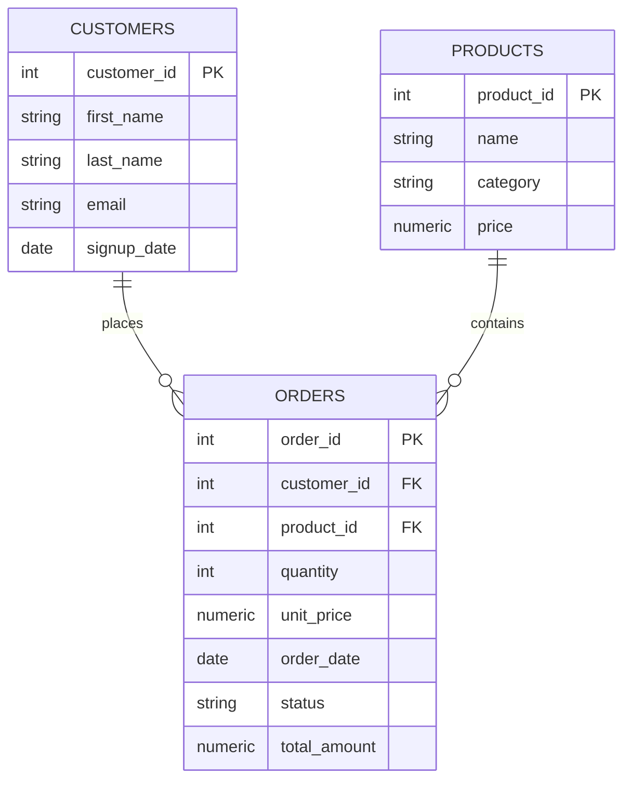

# Customer Orders ETL (S3 → Python → MySQL/Postgres)

A compact ETL demonstrating raw CSV ingestion from **AWS S3**, transformation with **pandas**, and loading into **MySQL/Postgres** with **data quality checks** and **analytics SQL**.

## ⚙️ Stack
- AWS S3, Python (pandas, boto3, SQLAlchemy), MySQL/Postgres
- GitHub Actions (optional) for daily runs

## 📐 ERD


## 🚀 Quickstart
1. Create DB and run schema:
   ```bash
   psql -h localhost -U postgres -d etl_demo -f sql/schema.sql
   # or: mysql -u root -p etl_demo < sql/schema.sql
   ```
2. Copy config and fill in credentials:
   ```bash
   cp src/config.example.yml src/config.yml
   ```
3. Install & run:
   ```bash
   pip install -r requirements.txt
   python src/extract_s3.py
   python src/transform.py
   python src/load_db.py
   ```
4. Run data quality + analytics SQL:
   ```bash
   psql ... -f tests/dq_tests.sql
   psql ... -f sql/analytics.sql
   ```

## 📊 KPIs & Queries
- Monthly Revenue, AOV, Top Products, **LTV**, **Repeat Rate**

See `sql/analytics.sql`.

## ✅ Data Quality
Null/duplicates/date-range checks in `tests/dq_tests.sql`.

## 🗓️ Automate
Add a GitHub Action or cron to run daily.
